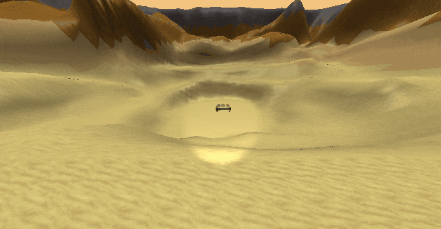

```text
.: PG2 :: OpenGL 3D app :.

## Dependencies ##

* openCV 4.9.0 not included, has to be installed separately:
      add system variable:
          Name:  OPENCV_DIR
          Value: ...\opencv\build
      add item to PATH:
          %OPENCV_DIR%\x64\vc16\bin

## Features ##

* Shooting jukebox will turn it on/off
* Shooting glass cubes will destroy them
* Jetpack

## Controls ##

* Keyboard
  * W A S D – movement
  * Ctrl    – sprint            – toggle
  * Space   – jetpack           – hold
  * F       – flashlight        – toggle
  * F11     – fullscreen        – toggle
  * V       – vsync             – toggle
  * R       – reset glass cubes
* Mouse
  * LMB     – shoot projectile
  * RMB     – enable/disable mouselook (you can move/resize window while mouselook is disabled)
  * scrollwheel to change FOV

## Sources ##

* CPP/OBJ/... – TUL FM ITE/PG2 (special thanks to Jiří Jeníček)
* Shaders     – Game Institute Inc., Steve Jones
* Textures    – RPGMaker tileset
* Models      – https://free3d.com/3d-model/jukebox-bubbler-style-v2--835086.html
              – https://free3d.com/3d-model/table-with-cloth-57780.html
* Sounds      – Minecraft bow, sand step
              – https://www.zapsplat.com/music/empty-glass-bottle-drop-into-a-plastic-bin-and-then-smash-against-others-10/
              – https://www.zapsplat.com/music/football-soccer-ball-single-bounce-on-gravel-ground-2/
              – https://www.zapsplat.com/music/loop-sequence-of-a-turbine-in-idle-or-steadily-powered-5/
* Music       – The Synapse (Hong Kong Streets) by Alexander Brandon

## Assignment ##

ESSENTIALS:
* [X] 3D GL Core profile + shaders at least 4.5, GL debug
* [X] high performance => at least 60 FPS
* [X] allow VSync control, fullscreen vs. windowed switching (restore window position & size)
* [X] event processing (camera, object, app behaviour...): mouse (both axes, wheel), keyboard
* [X] multiple different independently moving 3D models, at leats two loaded from file
* [X] at least three different textures (or subtextures from texture atlas etc.)
* [X] lighting model, at least 3 lights (ambient+directional+reflector: at least one is moving; + possible other lights)
* [X] correct full scale transparency (at least one transparent object; NOT if(alpha<0.1) {discard;} )

EXTRAS:
* [X] height map textured by height & proper player height coords
* [~] working collisions (only projectiles x environment)
* [ ] particles
* [ ] scripting (useful, e.g. Lua)
* [X] audio (better than just background)

INSTAFAIL:
* using GLUT, GL compatible profile
```
